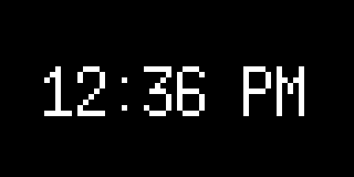

# Pixlet

A toolkit for developing [Tidbyt](http://www.tidbyt.com/) applets.

Tidbyt is a connected display, featuring a 64x32 RGB LED matrix. It
can do a lot out of the box, such as provide weather information,
stock tickers, subway times, and more. But part of the fun of Tidbyt
is building your own integrations. That's where Pixlet comes in.

## Documentation

- [The Tutorial](doc/tutorial.md)
- [Widget reference](doc/widgets.md)
- [Modules reference](doc/modules.md)
- [Notes on the available fonts](doc/fonts.md)

## How it works

Pixlet scripts are written in a simple, Python-like language called
[Starlark](https://github.com/google/starlark-go/). The scripts can
retrieve data over HTTP, transform it and use a collection of
_Widgets_ to describe how the data should be presented visually.

The Pixlet CLI runs these scripts and renders the result as a WebP
image. You can then push the image straight to your device via the
[Tidbyt API](https://tidbyt.dev/docs/tidbyt-api/docs/Guide.md).

### Example: A Clock App

This applet accepts a `timezone` parameter and produces a two frame
animation displaying the current time with a blinking ':' separator
between the hour and minute components.

```starlark
load("render.star", "render")
load("time.star", "time")

def main(config):
    timezone = config.get("timezone") or "America/New_York"
    now = time.now().in_location(timezone)
    return render.Frame(
        delay = 500,
        root = render.Box(
            child = render.Animation(
                children = [
                    render.Text(
                        content = now.format("3:04 PM"),
                        font = "6x13",
                    ),
                    render.Text(
                        content = now.format("3 04 PM"),
                        font = "6x13",
                    ),
                ],
            ),
        ),
    )
```

Here's the resulting image:


