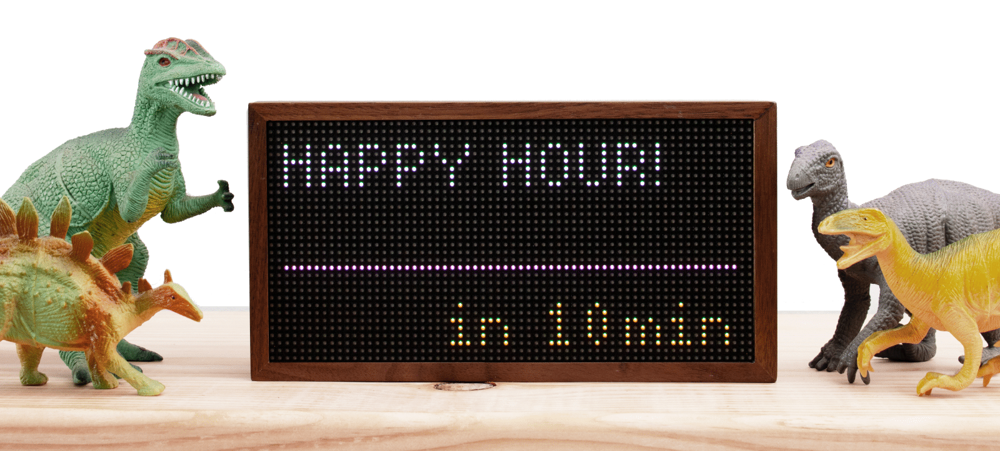
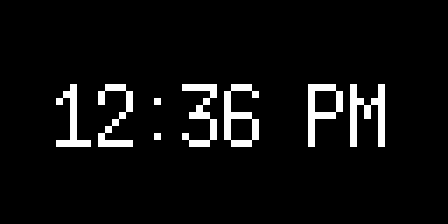
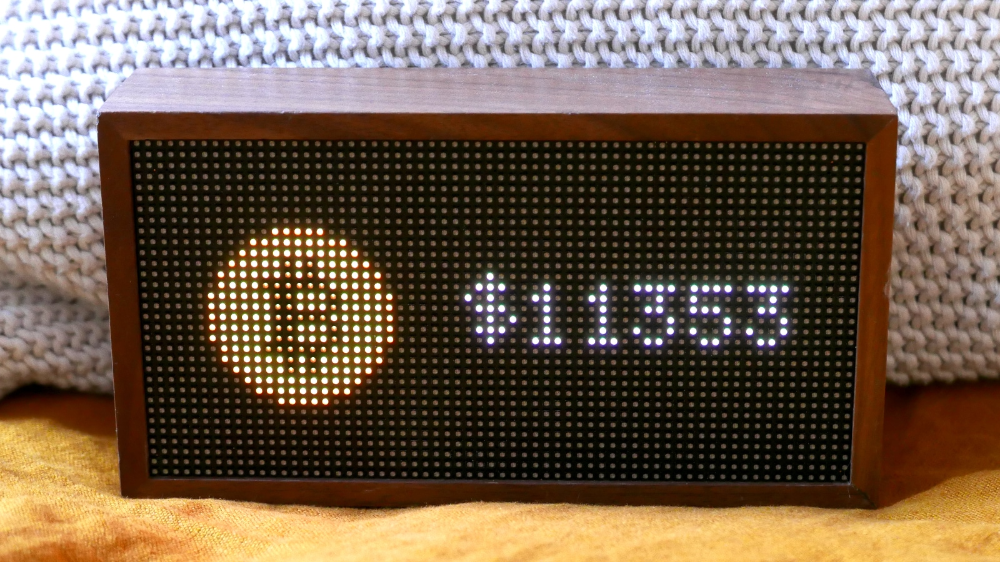
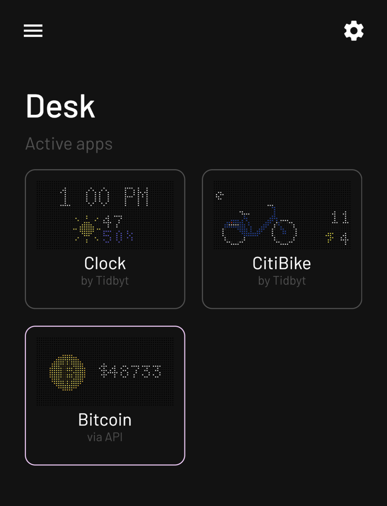

# Pixlet

[](https://github.com/tidbyt/pixlet/actions)
[](https://discuss.tidbyt.com/)
[](https://discord.gg/r45MXG4kZc)
[](https://godoc.org/github.com/tidbyt/pixlet/runtime)

Pixlet is an app runtime and UX toolkit for highly-constrained displays.
We use Pixlet to develop applets for [Tidbyt](https://tidbyt.com/), which has
a 64x32 RGB LED matrix display:

[](https://tidbyt.com)

Apps developed with Pixlet can be served in a browser, rendered as WebP or
GIF animations, or pushed to a physical Tidbyt device.

## Documentation

- [Getting started](#getting-started)
- [How it works](#how-it-works)
- [In-depth tutorial](docs/tutorial.md)
- [Widget reference](docs/widgets.md)
- [Modules reference](docs/modules.md)
- [Schema reference](docs/schema/schema.md)
- [Our thoughts on authoring apps](docs/authoring_apps.md)
- [Notes on the available fonts](docs/fonts.md)

## Getting started

### Install on macOS

```
brew install tidbyt/tidbyt/pixlet
```

### Install on Linux

Download the `pixlet` binary from [the latest release][1].

Alternatively you can [build from source](docs/BUILD.md).

[1]: https://github.com/tidbyt/pixlet/releases/latest

### Hello, World!

Pixlet applets are written in a simple, Python-like language called
Starlark. Here's the venerable Hello World program:

```starlark
load("render.star", "render")
def main():
    return render.Root(
        child = render.Text("Hello, World!")
    )
```

Render and serve it with:

```console
curl https://raw.githubusercontent.com/tidbyt/pixlet/main/examples/hello_world.star | \
  pixlet serve /dev/stdin
```

You can view the result by navigating to [http://localhost:8080][3]:


[3]: http://localhost:8080

## How it works

Pixlet scripts are written in a simple, Python-like language called
[Starlark](https://github.com/google/starlark-go/). The scripts can
retrieve data over HTTP, transform it and use a collection of
_Widgets_ to describe how the data should be presented visually.

The Pixlet CLI runs these scripts and renders the result as a WebP
or GIF animation. You can view the animation in your browser, save
it, or even push it to a Tidbyt device with `pixlet push`.

### Example: A Clock App

This applet accepts a `timezone` parameter and produces a two frame
animation displaying the current time with a blinking ':' separator
between the hour and minute components.

```starlark
load("render.star", "render")
load("time.star", "time")

def main(config):
    timezone = config.get("timezone") or "America/New_York"
    now = time.now().in_location(timezone)

    return render.Root(
        delay = 500,
        child = render.Box(
            child = render.Animation(
                children = [
                    render.Text(
                        content = now.format("3:04 PM"),
                        font = "6x13",
                    ),
                    render.Text(
                        content = now.format("3 04 PM"),
                        font = "6x13",
                    ),
                ],
            ),
        ),
    )
```

Here's the resulting image:



### Example: A Bitcoin Tracker

Applets can get information from external data sources. For example,
here is a Bitcoin price tracker:


Read the [in-depth tutorial](docs/tutorial.md) to learn how to
make an applet like this.

## Push to a Tidbyt

If you have a Tidbyt, `pixlet` can push apps directly to it. For example,
to show the Bitcoin tracker on your Tidbyt:

```
pixlet render examples/bitcoin.star
pixlet push --api-token <YOUR API TOKEN> <YOUR DEVICE ID> examples/bitcoin.webp
```

To get the ID and API key for a device, open the settings for the device in the Tidbyt app on your phone, and tap **Get API key**.

If all goes well, you should see the Bitcoin tracker appear on your Tidbyt:



## Push as an Installation
Pushing an applet to your Tidbyt without an installation ID simply displays your applet one time. If you would like your applet to continously display as part of the rotation, add an installation ID to the push command:

```
pixlet render examples/bitcoin.star
pixlet push --api-token <YOUR API TOKEN> --installation-id <INSTALLATION ID> <YOUR DEVICE ID> examples/bitcoin.webp
```

For example, if we set the `installationID` to "Bitcoin", it would appear in the mobile app as follows:



**Note:** `pixlet render` executes your Starlark code and generates a WebP image. `pixlet push` deploys the generated WebP image to your device. You'll need to repeat this process if you want to keep the app updated. You can also create [Community Apps](https://github.com/tidbyt/community) that run on Tidbyt’s servers and update automatically.
