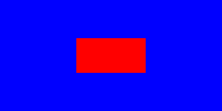
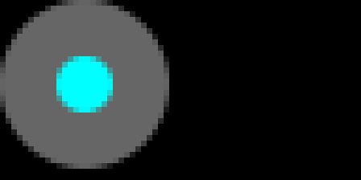
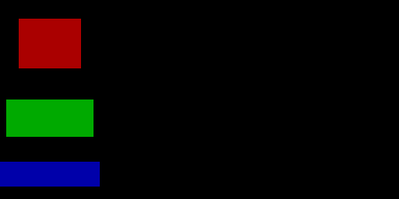
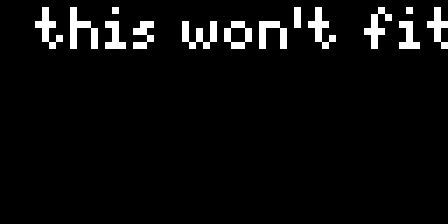
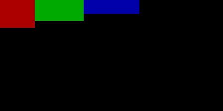
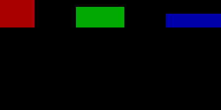
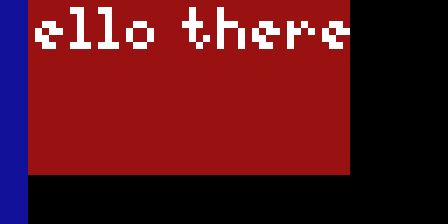
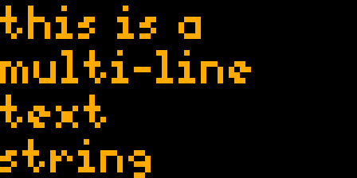

<!-- Docs generated by runtime/gen. DO NOT EDIT. -->

# Widgets!

Pixlet comes with a number of built-in _Widgets_. These are used to
describe how data should be laid out, presented and finally rendered
to an image file.

The easiest way to get started is probably to take a look at some of
the [examples](../examples/), and then refer to the detailed Widget
documentation (this document) when the need arises.


## Animation
Animations turns a list of children into an animation, where each
child is a frame.

FIXME: Behaviour when children themselves are animated is a bit
weird. Think and fix.

#### Attributes
| Name | Type | Description | Required |
| --- | --- | --- | --- |
| `children` | `list` | Children to use as frames in the animation | N |

#### Example
```
render.Animation(
     children=[
          render.Box(width=10, height=10, color="#300"),
          render.Box(width=12, height=12, color="#500"),
          render.Box(width=14, height=14, color="#700"),
          render.Box(width=16, height=16, color="#900"),
          render.Box(width=18, height=18, color="#b00"),
     ],
)
```


## Box
A Box is a rectangular widget that can hold a child widget.

Boxes are transparent unless `color` is provided. They expand to
fill all available space, unless `width` and/or `height` is
provided. Boxes can have a `child`, which will be centered in the
box, and the child can be padded (via `padding`).

#### Attributes
| Name | Type | Description | Required |
| --- | --- | --- | --- |
| `child` | `Widget` | Child to center inside box | N |
| `width` | `int` | Limits Box width | N |
| `height` | `int` | Limits Box height | N |
| `padding` | `int` | Padding around the child widget | N |
| `color` | `color` | Background color | N |

#### Example
```
render.Box(
     color="#00f",
     child=render.Box(
          width=20,
          height=10,
          color="#f00",
     )
)
```



## Circle
Circle draws a circle with the given `diameter` and `color`. If a
`child` widget is provided, it is drawn in the center of the
circle.

#### Attributes
| Name | Type | Description | Required |
| --- | --- | --- | --- |
| `color` | `color` | Fill color | **Y** |
| `diameter` | `int` | Diameter of the circle | **Y** |
| `child` | `Widget` | Widget to place in the center of the circle | N |

#### Example
```
render.Circle(
     color="#666",
     diameter=30,
     child=render.Circle(color="#0ff", diameter=10),
)
```



## Column
Column lays out and draws its children vertically (in a column).

By default, a Column is as small as possible, while still holding
all its children. However, if `expanded` is set, the Column will
fill all available space vertically. The width of a Column is
always that of its widest child.

Alignment along the vertical main axis is controlled by passing
one of the following `main_align` values:
- `"start"`: place children at the beginning of the column
- `"end"`: place children at the end of the column
- `"center"`: place children in the middle of the column
- `"space_between"`: place equal space between children
- `"space_evenly"`: equal space between children and before/after first/last child
- `"space_around"`: equal space between children, and half of that before/after first/last child

Alignment along the horizontal cross axis is controlled by passing
one of the following `cross_align` values:
- `"start"`: place children at the left
- `"end"`: place children at the right
- `"center"`: place children in the center

#### Attributes
| Name | Type | Description | Required |
| --- | --- | --- | --- |
| `children` | `list` | Child widgets to lay out | **Y** |
| `main_align` | `str` | Alignment along vertical main axis | N |
| `cross_align` | `str` | Alignment along horizontal cross axis | N |
| `expanded` | `bool` | Column should expand to fill all available vertical space | N |

#### Example
```
render.Column(
     children=[
          render.Box(width=10, height=8, color="#a00"),
          render.Box(width=14, height=6, color="#0a0"),
          render.Box(width=16, height=4, color="#00a"),
     ],
)
```

#### Example
```
render.Column(
     expanded=True,
     main_align="space_around",
     cross_align="center",
     children=[
          render.Box(width=10, height=8, color="#a00"),
          render.Box(width=14, height=6, color="#0a0"),
          render.Box(width=16, height=4, color="#00a"),
     ],
)
```



## Image
Image renders the binary image data passed via `src`. Supported
formats include PNG, JPEG and GIF.

If `width` or `height` are set, the image will be scaled
accordingly, with nearest neighbor interpolation. Otherwise the
image's original dimensions are used.

If the image data encodes an animated GIF, the Image instance will
also be animated. Frame delay (in milliseconds) can be read from
the `delay` attribute.

#### Attributes
| Name | Type | Description | Required |
| --- | --- | --- | --- |
| `src` | `str` | Binary image data | **Y** |
| `width` | `int` | Scale image to this width | N |
| `height` | `int` | Scale image to this height | N |
| `delay` | `int` | (Read-only) Frame delay in ms, for animated GIFs | N |


## Marquee
Marquee scrolls its child horizontally.

The height of the Marquee will be that of its child, but its
`width` must be specified explicitly. If the child's width fits
fully, it will not scroll. Otherwise, it will be scrolled right to
left.

The `offset_start` and `offset_end` parameters control the position
of the child in the beginning and the end of the animation.

#### Attributes
| Name | Type | Description | Required |
| --- | --- | --- | --- |
| `child` | `Widget` | Widget to potentially scroll | **Y** |
| `width` | `int` | Width of the Marquee | **Y** |
| `offset_start` | `int` | Position of child at beginning of animation | N |
| `offset_end` | `int` | Position of child at end of animation | N |

#### Example
```
render.Marquee(
     width=64,
     child=render.Text("this won't fit in 64 pixels"),
     offset_start=5,
     offset_end=32,
)
```



## Padding
Padding places padding around its child.

If the `pad` attribute is a single integer, that amount of padding
will be placed on all sides of the child. If it's a 4-tuple `(left,
top, right, bottom)`, then padding will be placed on the sides
accordingly.

#### Attributes
| Name | Type | Description | Required |
| --- | --- | --- | --- |
| `child` | `Widget` | The Widget to place padding around | **Y** |
| `pad` | `insets` | Padding around the child | N |
| `expanded` | `bool` | This is a confusing parameter | N |


## Row
Row lays out and draws its children horizontally (in a row).

By default, a Row is as small as possible, while still holding all
its children. However, if `expanded` is set, the Row will fill all
available space horizontally. The height of a Row is always that of
its tallest child.

Alignment along the horizontal main axis is controlled by passing
one of the following `main_align` values:
- `"start"`: place children at the beginning of the row
- `"end"`: place children at the end of the row
- `"center"`: place children in the middle of the row
- `"space_between"`: place equal space between children
- `"space_evenly"`: equal space between children and before/after first/last child
- `"space_around"`: equal space between children, and half of that before/after first/last child

Alignment along the vertical cross axis is controlled by passing
one of the following `cross_align` values:
- `"start"`: place children at the top
- `"end"`: place children at the bottom
- `"center"`: place children at the center

#### Attributes
| Name | Type | Description | Required |
| --- | --- | --- | --- |
| `children` | `list` | Child widgets to lay out | **Y** |
| `main_align` | `str` | Alignment along horizontal main axis | N |
| `cross_align` | `str` | Alignment along vertical cross axis | N |
| `expanded` | `bool` | Row should expand to fill all available horizontal space | N |

#### Example
```
render.Row(
     children=[
          render.Box(width=10, height=8, color="#a00"),
          render.Box(width=14, height=6, color="#0a0"),
          render.Box(width=16, height=4, color="#00a"),
     ],
)
```

#### Example
```
render.Row(
     expanded=True,
     main_align="space_between",
     cross_align="end",
     children=[
          render.Box(width=10, height=8, color="#a00"),
          render.Box(width=14, height=6, color="#0a0"),
          render.Box(width=16, height=4, color="#00a"),
     ],
)
```



## Stack
Stack draws its children on top of each other.

Just like a stack of pancakes, except with Widgets instead of
pancakes. The Stack will be given a width and height sufficient to
fit all its children.

#### Attributes
| Name | Type | Description | Required |
| --- | --- | --- | --- |
| `children` | `list` | Widgets to stack | **Y** |

#### Example
```
render.Stack(
     children=[
          render.Box(width=50, height=25, color="#911"),
          render.Text("hello there"),
          render.Box(width=4, height=32, color="#119"),
     ],
)
```



## Text
Text draws a string of text on a single line.

By default, the text will use the "tb-8" font, but other fonts can
be chosen via the `font` attribute. The `height` and `offset`
parameters allow fine tuning of the vertical layout of the
string. Take a look at the [font documentation](fonts.md) for more
information.

#### Attributes
| Name | Type | Description | Required |
| --- | --- | --- | --- |
| `content` | `str` | The text string to draw | **Y** |
| `font` | `str` | Desired font face | N |
| `height` | `int` | Limits height of the area on which text is drawn | N |
| `offset` | `int` | Shifts position of text vertically. | N |
| `color` | `color` | Desired font color | N |

#### Example
```
render.Text(content="Tidbyt!", color="#099")
```


## WrappedText
WrappedText draws multi-line text.

The optional `width` and `height` parameters limit the drawing
area. If not set, WrappedText will use as much vertical and
horizontal space as possible to fit the text.

#### Attributes
| Name | Type | Description | Required |
| --- | --- | --- | --- |
| `content` | `str` | The text string to draw | **Y** |
| `font` | `str` | Desired font face | N |
| `height` | `int` | Limits height of the area on which text may be drawn | N |
| `width` | `int` | Limits width of the area on which text may be drawn | N |
| `linespacing` | `int` | Controls spacing between lines | N |
| `color` | `color` | Desired font color | N |

#### Example
```
render.WrappedText(
      content="this is a multi-line text string",
      width=50,
      color="#fa0",
)
```



