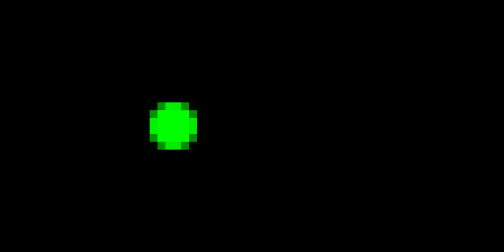

<!-- Docs generated by runtime/gen. DO NOT EDIT. -->

# Animations!

Pixlet supports a few animation primitives. These are used to animate
widgets from frame to frame.

All animations allow specifying an easing curve. This can either be one
of the built-in "linear", "ease_in", "ease_out" or "ease_in_out" curves,
a custom cubic bézier curve in the form "cubic-bezier(a, b, c, d)" or a
custom easing function.

**Warning**: The animation module is in a state of flux. Especially
`Transformation` and related classes are likely to change in the near
term. Please be on the lookout for bugs, issues and potential
improvements!


## AnimatedPositioned
Animate a widget from start to end coordinates.

**DEPRECATED**: Please use `animation.Transformation` instead.

#### Attributes
| Name | Type | Description | Required |
| --- | --- | --- | --- |
| `child` | `Widget` | Widget to animate | **Y** |
| `duration` | `int` | Duration of animation in frames | **Y** |
| `curve` | `str / function` | Easing curve to use, default is 'linear' | **Y** |
| `x_start` | `int` | Horizontal start coordinate | N |
| `x_end` | `int` | Horizontal end coordinate | N |
| `y_start` | `int` | Vertical start coordinate | N |
| `y_end` | `int` | Vertical end coordinate | N |
| `delay` | `int` | Delay before animation in frames | N |
| `hold` | `int` | Delay after animation in frames | N |


## Keyframe
A keyframe defining specific point in time in the animation.

The keyframe _percentage_ can is expressed as a floating point value between `0.0` and `1.0`.

#### Attributes
| Name | Type | Description | Required |
| --- | --- | --- | --- |
| `percentage` | `float` | Percentage of the time at which this keyframe occurs through the animation. | **Y** |
| `transforms` | `[Transform]` | List of transforms at this keyframe to interpolate to or from. | **Y** |
| `curve` | `str / function` | Easing curve to use, default is 'linear' | N |


## Origin
An relative anchor point to use for scaling and rotation transforms.

#### Attributes
| Name | Type | Description | Required |
| --- | --- | --- | --- |
| `x` | `float` | Horizontal anchor point | **Y** |
| `y` | `float` | Vertical anchor point | **Y** |


## Rotate
Transform by rotating by a given angle in degrees.

#### Attributes
| Name | Type | Description | Required |
| --- | --- | --- | --- |
| `angle` | `float / int` | Angle to rotate by in degrees | **Y** |


## Scale
Transform by scaling by a given factor.

#### Attributes
| Name | Type | Description | Required |
| --- | --- | --- | --- |
| `x` | `float / int` | Horizontal scale factor | **Y** |
| `y` | `float / int` | Vertical scale factor | **Y** |


## Transformation
Transformation makes it possible to animate a child widget by
transitioning between transforms which are applied to the child wiget.

It supports animating translation, scale and rotation of its child.

If you have used CSS transforms and animations before, some of the
following concepts will be familiar to you.

Keyframes define a list of transforms to apply at a specific point in
time, which is given as a percentage of the total animation duration.

A keyframe is created via `animation.Keyframe(percentage, transforms, curve)`.

The `percentage` specifies its point in time and can be expressed as
a floating point number in the range `0.0` to `1.0`.

In case a keyframe at percentage 0% or 100% is missing, a default
keyframe without transforms and with a "linear" easing curve is inserted.

As the animation progresses, transforms defined by the previous and
next keyframe will be interpolated to determine the transform to apply
at the current frame.

The `duration` and `delay` of the animation are expressed as a number
of frames.

By default a transform `origin` of `animation.Origin(0.5, 0.5)` is used,
which defines the anchor point for scaling and rotation to be exactly the
center of the child widget. A different `origin` can be specified by
providing a custom `animation.Origin`.

The animation `direction` defaults to `normal`, playing the animation
forwards. Other possible values are `reverse` to play it backwards,
`alternate` to play it forwards, then backwards or `alternate-reverse`
to play it backwards, then forwards.

The animation `fill_mode` defaults to `forwards`, and controls which
transforms will be applied to the child widget after the animation
finishes. A value of `forwards` will retain the transforms of the last
keyframe, while a value of `backwards` will rever to the transforms
of the first keyframe.

When translating the child widget on the X- or Y-axis, it often is
desireable to round to even integers, which can be controlled via
`rounding`, which defaults to `round`. Possible values are `round` to
round to the nearest integer, `floor` to round down, `ceil` to round
up or `none` to not perform any rounding. Rounding only is applied for
translation transforms, but not to scaling or rotation transforms.

If `wait_for_child` is set to `True`, the animation will finish and
then wait for all child frames to play before restarting. If it is set
to `False`, it will not wait.

#### Attributes
| Name | Type | Description | Required |
| --- | --- | --- | --- |
| `child` | `Widget` | Widget to animate | **Y** |
| `keyframes` | `[Keyframe]` | List of animation keyframes | **Y** |
| `duration` | `int` | Duration of animation (in frames) | **Y** |
| `delay` | `int` | Duration to wait before animation (in frames) | N |
| `width` | `int` | Width of the animation canvas | N |
| `height` | `int` | Height of the animation canvas | N |
| `origin` | `Origin` | Origin for transforms, default is '50%, 50%' | N |
| `direction` | `str` | Direction of the animation, default is 'normal' | N |
| `fill_mode` | `str` | Fill mode of the animation, default is 'forwards' | N |
| `rounding` | `str` | Rounding to use for interpolated translation coordinates (not used for scale and rotate), default is 'round' | N |
| `wait_for_child` | `bool` | Wait for all child frames to play after finishing | N |

#### Example
```
animation.Transformation(
  child = render.Box(render.Circle(diameter = 6, color = "#0f0")),
  duration = 100,
  delay = 0,
  origin = animation.Origin(0.5, 0.5),
  direction = "alternate",
  fill_mode = "forwards",
  keyframes = [
    animation.Keyframe(
      percentage = 0.0,
      transforms = [animation.Rotate(0), animation.Translate(-10, 0), animation.Rotate(0)],
      curve = "ease_in_out",
    ),
    animation.Keyframe(
      percentage = 1.0,
      transforms = [animation.Rotate(360), animation.Translate(-10, 0), animation.Rotate(-360)],
    ),
  ],
),
```



## Translate
Transform by translating by a given offset.

#### Attributes
| Name | Type | Description | Required |
| --- | --- | --- | --- |
| `x` | `float / int` | Horizontal offset | **Y** |
| `y` | `float / int` | Vertical offset | **Y** |


