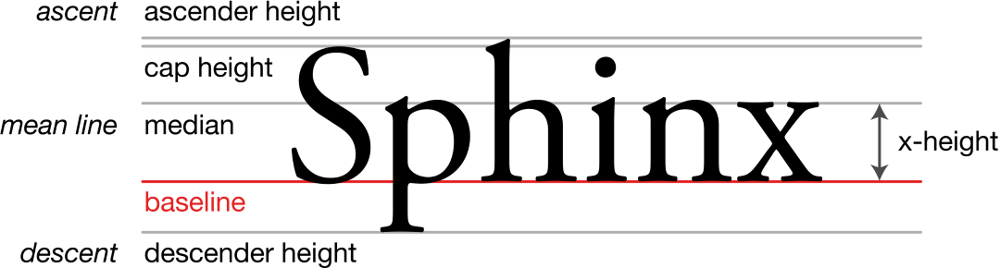

# Pixlet Fonts

Pixlet offers a couple of different fonts for rendering text. Which
one to use depends on the information being presented and the amount
of space available when rendering. Pixlet's `Text` Widget attempts to
draw the font on the baseline, i.e. offset upwards by the font's
descent. And if that sentence made no sense to you, read then next
section. =)

## Typography and Unicode refresher

Our most important Unicode block is Basic Latin (a.k.a. ASCII). We
also need at least the Latin-1 Supplement block (a.k.a. ISO 8859,
"Latin-1") to be able to render symbols like Ñ, Ä and Ö. These matter
a lot when displaying names of people, locations, etc.

The definitions in this graphic are helpful:

In addition to these, a glyph's _advance_ is the distance between its
"origin point", i.e. the leftmost point of the baseline, and the
following glyph.

A _cap height_ of 6 and a _descent_ of 1 is sufficient to fit both
upper and lower case A-Z, as well as the most common special
characters. From fiddling with fonts a bit, this seems to be the
minimum.

To cover Latin-1 Supplement, we need more space. At least one
additional pixel in the _ascent_ for characters with diacritics to be
legible.

## The fonts

Note that all of these are free or public domain fonts created by
others. Attribution is given for each below.

### tb-8

A modified version of 5x8. This font has variable advance (i.e. it's
not mono-spaced) and slightly tweaked glyphs for improved
legibility. All digits are monospace with advance 5.

Like 5x8, this covers Basic Latin and Latin-1 Supplement, plus some
other latin glyphs.

All digits in tb-8 are monospaced 5x6, so rendering them with a
baseline offset of -1 and a height of 6 is perfectly fine and renders
the full glyphs without cropping.

Common numerical symbols ('+', '-', '/', '*', '=', '%', '.') also fit
in height 6 with offset -1. These are however all variable-width. Note
that ',' has descent 1 and won't fit in this case.

Currency symbols require full height in the general case, but euro
sign '€' and dollar sign '$' have no descent and fit in 7 pixels.

- Advance: 2-6
- Height: 8
- Cap height: 6
- Ascent: 7
- Descent: 1

### Dina_r400-6
By [Jørgen Ibsen](https://www.dcmembers.com/jibsen/download/61/)

Covers Basic Latin and Latin-1 Supplement, but nothing beyond
that. 256 code points.

- Advance: 6
- Height: 10
- Cap height: 6
- Ascent: 8
- Descent: 2

### 5x8
By [Markus Kuhn](http://www.cl.cam.ac.uk/~mgk25/).

Covers Basic Latin, Latin-1 Supplement, a ton of other Latin code
blocks. 1426 code points in total.

- Advance: 5
- Height: 8
- Cap height: 6
- Ascent: 7
- Descent: 1

### 6x13
By [Markus Kuhn](http://www.cl.cam.ac.uk/~mgk25/).

Covers Basic Latin, Latin1- Supplement, and a bazillion other glyphs,
including the runic code block. 4121 code points in total.

- Advance: 6
- Height: 13
- Cap height: 9
- Ascent: 11
- Descent: 2

### 10x20
By [Markus Kuhn](http://www.cl.cam.ac.uk/~mgk25/).

Covers Basic Latin, Latin1- Supplement, and a bazillion other glyphs,
including the runic code block. 4121 code points in total.

- Advance: 10
- Height: 20
- Cap height: 13
- Ascent: 16
- Descent: 4

### tom-thumb
By [Robey Pointer](https://robey.lag.net/2010/01/23/tiny-monospace-font.html)

A very tiny, monospace, bitmap font. It's a 4x6 font with 3x5 usable pixels.
This font is great for a really tiny font that also supports upper and lower
cased characters.

- Advance: 4
- Height: 6
- Cap height: 4
- Ascent: 5
- Descent: 1

### CG-pixel-3x5-mono
By [Ilmari Karonen](https://vyznev.net/)

This font is a true 3x5 font which only occupies 5 pixels on a display. Check
out the 4x5 version if you have the width to spare.

- Advance: 4
- Height: 5
- Cap height: 4
- Ascent: 5
- Descent: 0

### CG-pixel-4x5-mono
By [Ilmari Karonen](https://vyznev.net/)

This font is a true 4x5 font which only occupies 5 pixels on a display. Check
out the 3x5 version if you are also constrained on width.

- Advance: 5
- Height: 5
- Cap height: 4
- Ascent: 5
- Descent: 0