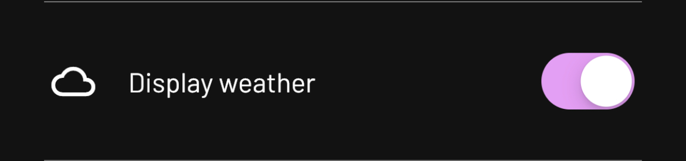
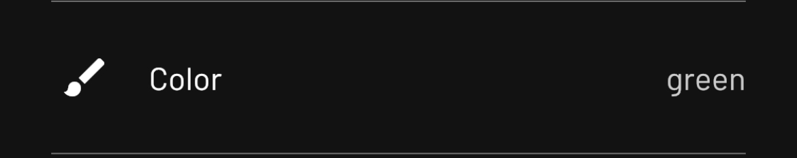
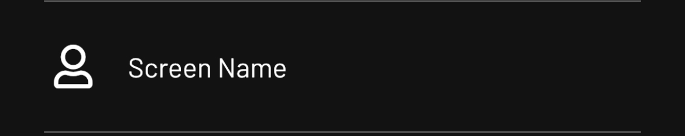

# Schema
Schema provides structure for configuring apps. We use schema inside of the Tidbyt mobile app to allow configuring starlark applications and store the values inside of our database.

The way it works is quite simple. We call `get_schema` and supply the fields to the mobile app. When a user hits save, we store the results in our database. Every time we render the app, we pass the values into config at the provided identifier.

> Note: Schema is for configuring apps submitted to [Community Apps](https://github.com/tidbyt/community). We're working on adding tighter integration into Pixlet so that pixlet commands make better use of schema.

## Quick Start
Let's add a toggle and a text input to our hello world example. Here it is before we add schema:
```starlark
load("render.star", "render")

def main():
    return render.Root(
        child = render.Text("Hello, World!"),
    )
```

This is a quick start, so let's start with the code and we'll break it down:

```starlark
load("render.star", "render")
load("schema.star", "schema")

DEFAULT_WHO = "World"

def main(config):
	message = "Hello, %s!" % config.str("who", DEFAULT_WHO)

    if config.bool("small"):
        msg = render.Text(message, font = "CG-pixel-3x5-mono")
    else:
        msg = render.Text(message)

    return render.Root(
        child = msg,
    )

def get_schema():
    return schema.Schema(
        version = "1",
        fields = [
            schema.Text(
				id = "who",
				name = "Who?",
				desc = "Who to say hello to.",
				icon = "user",
            ),
            schema.Toggle(
                id = "small",
                name = "Display small text",
                desc = "A toggle to display smaller text.",
                icon = "compress",
                default = False,
            ),
        ],
    )
```

The big change here is the `get_schema` method. This is the method we will call before rendering your app when running inside of our [Community Apps](https://github.com/tidbyt/community) repo. A quick note - we don't call this method using Pixlet at this time.

The `get_schema` method returns a `schema.Schema` object that contains _fields_. See below for a complete breakdown of what config options are available. In our example, we use a toggle and a text input.

Next up should be more familiar. We're now passing `config` into `main()`. This is the same for current pixlet scripts that take `config` today. In [Community Apps](https://github.com/tidbyt/community), we will populate the config hashmap with values configured from the mobile app.

That's about it!

## Icons
Each schema field takes an `icon` value. We use the free icons from [Font Awesome](https://fontawesome.com/) with the names camel cased. For example [users-cog](https://fontawesome.com/v5.15/icons/users-cog?style=solid) should be `usersCog` in the `icon` value.

## Fields
These are the current fields we support through schema today. Note that any addition of a field will require changes in our mobile app before we can truly support them.

### Toggle
A toggle provides an on/off switch for your app. The values returned in `config` are either `True` or `False`.

The following field will display as follows in the mobile app:
```starlark
schema.Toggle(
	id = "display_weather",
	name = "Display weather",
	desc = "A toggle to display weather or not.",
	icon = "cloud",
	default = True,
)
```


### Location
A location field provides a location selection option inside of the mobile app. It's populated with the devices location. Note - if you're adding location to your app and want to call external APIs with this data, we will ask you to truncate the location to avoid leaking location data to third-parties.

```starlark
schema.Location(
	id = "location",
	name = "Location",
	desc = "Location for which to display time.",
	icon = "place",
)
```


When you get location using `config.get("location")`, we will return the location in the following format:
```json
{
	"lat": "40.6781784",
	"lng": "-73.9441579",
	"description": "Brooklyn, NY, USA",
	"locality": "Brooklyn",
	"place_id": "ChIJCSF8lBZEwokRhngABHRcdoI",
	"timezone": "America/New_York"
}
```

### Dropdown
A dropdown provides a selection from a list of options. Options are a key/value pair where the display is the text displayed in the mobile app and the value is what is returned in `config` to the starlark app.

```starlark
options = [
	schema.Option(
		display = "green",
		value = "#00FF00",
	),
	schema.Option(
		display = "red",
		value = "#FF0000",
	),
]
	
schema.Dropdown(
	id = "colors",
	name = "Color",
	desc = "The color of text to be displayed.", 
	icon = "brush",
	default = options[0].value,
	options = options,
)
```


### Text
The `Text` schema option provides a text entry box for a string entered by the user.

```starlark
schema.Text(
	id = "screen_name",
	name = "Screen Name",
	desc = "A text entry for your screen name.",
	icon = "user",
)
```

