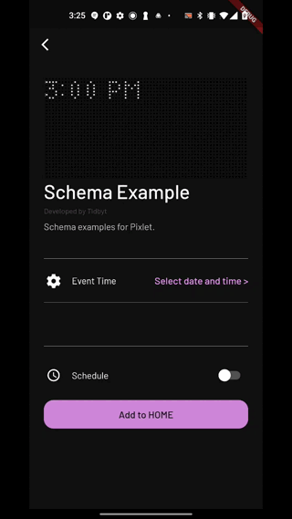
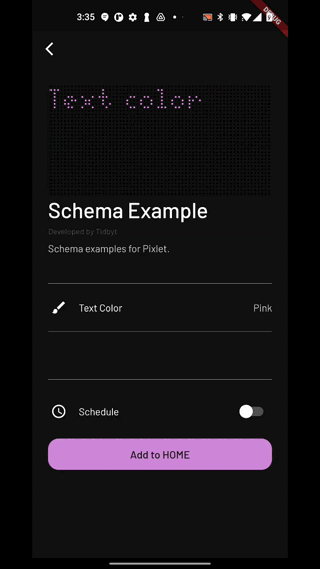
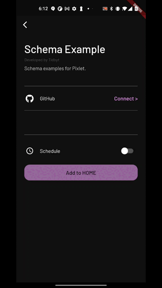
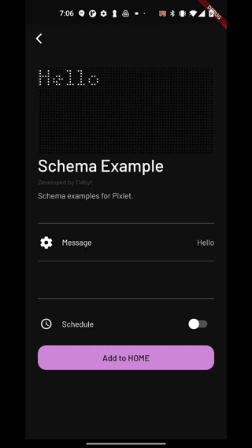
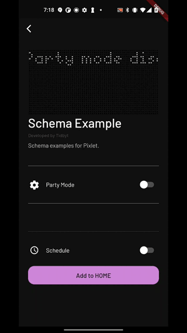
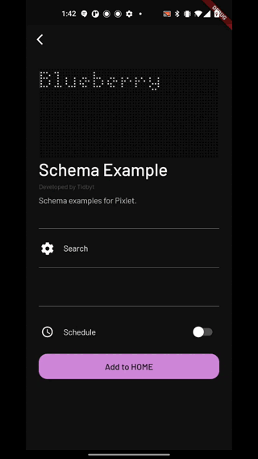

# Schema
Schema provides structure for configuring apps. We use schema inside of the Tidbyt mobile app to allow configuring starlark applications and store the values inside of our database.

In order to supply fields to the mobile app, we call `get_schema()`. When a user saves the installation, we store the results in our database. Every time we render the app, we pass the values into the `config` key/value at the provided identifier.

> Note: Schema is for configuring apps submitted to [Community Apps](https://github.com/tidbyt/community). We're working on adding tighter integration into Pixlet so that pixlet commands make better use of schema.

## Quick Start
Let's add a toggle and a text input to our hello world example. Here it is before we add schema:
```starlark
load("render.star", "render")

def main():
    return render.Root(
        child = render.Text("Hello, World!"),
    )
```

This is a quick start, so let's start with the code and we'll break it down:

```starlark
load("render.star", "render")
load("schema.star", "schema")

DEFAULT_WHO = "World"

def main(config):
    message = "Hello, %s!" % config.str("who", DEFAULT_WHO)

    if config.bool("small"):
        msg = render.Text(message, font = "CG-pixel-3x5-mono")
    else:
        msg = render.Text(message)

    return render.Root(
        child = msg,
    )

def get_schema():
    return schema.Schema(
        version = "1",
        fields = [
            schema.Text(
                id = "who",
                name = "Who?",
                desc = "Who to say hello to.",
                icon = "user",
            ),
            schema.Toggle(
                id = "small",
                name = "Display small text",
                desc = "A toggle to display smaller text.",
                icon = "compress",
                default = False,
            ),
        ],
    )
```

The big change here is the `get_schema` method. This is the method we will call before rendering your app when running inside of our [Community Apps](https://github.com/tidbyt/community) repo. A quick note - we don't call this method using Pixlet at this time.

The `get_schema` method returns a `schema.Schema` object that contains _fields_. See below for a complete breakdown of what fields are available. In our example, we use a `Toggle` and a `Text` field.

Next up should be more familiar. We're now passing `config` into `main()`. This is the same for current pixlet scripts that take `config` today. In [Community Apps](https://github.com/tidbyt/community), we will populate the config hashmap with values configured from the mobile app.

## Icons
Each schema field takes an `icon` value. We use the free icons from [Font Awesome](https://fontawesome.com/v6/search?s=solid%2Cbrands) at version 6.1.1 with the names camel cased. For example [users-cog](https://fontawesome.com/v6/icons/users-cog?style=solid&s=solid) should be `usersCog` in the `icon` value. When submitting to the community repo, the icon names are validated against this [icon map](https://github.com/tidbyt/community/blob/main/apps/icons.go).

## Dynamic Fields
Pixlet offers two types of fields: basic fields like `Toggle` or `Text` and dynamic fields that take a `handler` method like `LocationBased` or `Typeahead`. For dynamic fields, the `handler` will get called with user inputs. What the handler returns is specific to the field.

## Fields
These are the current fields we support through schema today. Note that any addition of a field will require changes in our mobile app before we can truly support them.

### Datetime

> [Example App](datetime/example.star)

Datetime provides a picker for a date and time. It is provided in `config` as a string that is parsable by `time.parse_time()`.

```starlark
schema.DateTime(
    id = "event_time",
    name = "Event Time",
    desc = "The time of the event.",
    icon = "gear",
)
```

### Dropdown


A dropdown provides a selection from a list of options. Options are a key/value pair where the display is the text displayed in the mobile app and the value is what is returned in `config` to the starlark app.

Options:
```starlark
options = [
    schema.Option(
        display = "Pink",
        value = "#FF94FF",
    ),
    schema.Option(
        display = "Mustard",
        value = "#FFD10D",
    ),
]
```

Dropdown:
```starlark
schema.Dropdown(
    id = "color",
    name = "Text Color",
    desc = "The color of text to be displayed.",
    icon = "brush",
    default = options[0].value,
    options = options,
)
```

### Generated
> [Example App](generated/example.star)

The generated field allows for a schema field to generate additional schema
fields 🤯. User beware - this field is both not user friendly and our tooling
likely has a fair number of bugs. The benefit though is the ability to ask the
user for additional fields depending on their input. 


In this example, `source` is the `id` of the field that will be passed to the
`handler`. So if there is a text field with `id = pet`, the value of the pet
text field will be passed to `more_options`:
```starlark
schema.Generated(
    id = "generated",
    source = "pet",
    handler = more_options,
)
```

Note - the value that is passed to the handler is dependent on the source field
type. A handler might look as follows:

```starlark
def more_options(pet):
    if pet == "dog":
        return [
            schema.Toggle(
                id = "leash",
                name = "Leash",
                desc = "A toggle to enable a dog leash.",
                icon = "gear",
                default = False,
            ),
        ]
    elif pet == "cat":
        return [
            schema.Toggle(
                id = "litter-box",
                name = "Litter Box",
                desc = "A toggle to enable a litter box.",
                icon = "gear",
                default = False,
            ),
        ]
    else:
        return []
```

### Location

> [Example App](location/example.star)

A location field provides a location selection option inside of the mobile app. It's populated with the devices location. Note - if you're adding location to your app and want to call external APIs with this data, we will ask you to truncate the location to avoid leaking location data to third-parties.

```starlark
schema.Location(
    id = "location",
    name = "Location",
    desc = "Location for which to display time.",
    icon = "locationDot",
)
```

When you get location using `config.get("location")`, we will return the location in the following format:
```json
{
	"lat": "40.6781784",
	"lng": "-73.9441579",
	"description": "Brooklyn, NY, USA",
	"locality": "Brooklyn",
	"place_id": "ChIJCSF8lBZEwokRhngABHRcdoI",
	"timezone": "America/New_York"
}
```

### LocationBased

> [Example App](locationbased/example.star)

A `LocationBased` field provides a list of `Option` objects to the user by calling a handler method with the user provided location. This field can be used to populate a list of options based on the location provided by the user.

```starlark
schema.LocationBased(
    id = "station",
    name = "Train Station",
    desc = "A list of train stations based on a location.",
    icon = "train",
    handler = get_stations,
)
```

A handler for `LocationBased` is provided a location object:
```json
{
	"lat": "40.6781784",
	"lng": "-73.9441579",
	"description": "Brooklyn, NY, USA",
	"locality": "Brooklyn",
	"place_id": "ChIJCSF8lBZEwokRhngABHRcdoI",
	"timezone": "America/New_York"
}
```

The handler needs to return a list of `Option` objects where the display is value is what the user will see and the value is what will be provided to your app:
```starlark
def get_stations(location):
    loc = json.decode(location)

    return [
        schema.Option(
            display = "Grand Central",
            value = "grand_central",
        ),
    ]
```

The value provided to `config.get()` is a JSON string with display and values provided:
```json
{"display": "Grand Central", "value": "grand_central"}
```

### OAuth2

> [Example App](oauth2/example.star)

The `OAuth2` field provides mechanism to authenticate a user via an OAuth2 compatible API. 

```starlark
schema.OAuth2(
    id = "auth",
    name = "GitHub",
    desc = "Connect your GitHub account.",
    icon = "github",
    handler = oauth_handler,
    client_id = "your-client-id",
    authorization_endpoint = "https://github.com/login/oauth/authorize",
    scopes = [
        "read:user",
    ],
)
```

The handler for `OAuth2` looks as follows:
```starlark
def oauth_handler(params):
    params = json.decode(params)
	# handle oauth2 flow (see Example App)
	return "access-token"
```

Params is a JSON encoded string:
```json
{"code": "your-code", "grant_type": "authorization_code", "client_id": "your-client-id", "redirect_uri": "https://appauth.tidbyt.com/your-app-id"}
```

When configuring your OAuth2 app with the third-party provider, the authorization callback URL should be as follows:
```
https://appauth.tidbyt.com/{{ your_app_id }}
```

### PhotoSelect

> [Example App](photoselect/example.star)

The `PhotoSelect` field provides a photo picker to the user. The selected image will be cropped to 64x32 pixels and be available through `config` as a base64 encoded string.

```starlark
schema.PhotoSelect(
    id = "photo",
    name = "Add Photo",
    desc = "A photo to display.",
    icon = "gear",
)
```

You can use the provided image as follows in your app:
```starlark
img = base64.decode(config.get("photo"))
render.Image(img)
```

### Text

> [Example App](text/example.star)

The `Text` field provides a text entry box for a string entered by the user.

```starlark
schema.Text(
    id = "msg",
    name = "Message",
    desc = "A message to display.",
    icon = "gear",
    default = "Hello",
)
```

### Toggle

> [Example App](toggle/example.star)

A toggle provides an on/off switch for your app. The values returned in `config` are either `True` or `False`. Remember to use `config.bool()` to ensure the results are cast to a boolean.

```starlark
schema.Toggle(
    id = "party_mode",
    name = "Party Mode",
    desc = "A toggle to enable party mode.",
    icon = "gear",
    default = False,
)
```

Remember to request the value as a bool when getting the value from `config`:
```
config.bool("party_mode", False)
```

### Typeahead

> [Example App](typeahead/example.star)

The `Typeahead` field provides a list of options based on user input. 

```starlark
schema.Typeahead(
    id = "search",
    name = "Search",
    desc = "A list of items that match search.",
    icon = "gear",
    handler = search,
)
```

A handler for `Typeahead` takes the search string as a parameter to the function and returns a list of `Option` objects:
```starlark
def search(pattern):
    if pattern.startswith("a"):
        return [
            schema.Option(
                display = "Apple",
                value = "apple",
            )
		]

	return []
```

The value provided to `config.get()` is a JSON string with display and values provided:
```json
{"display": "Apple", "value": "apple"}
```