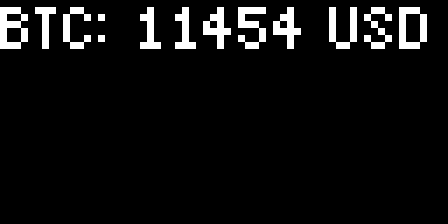

# Tutorial: A Bitcoin price tracker

This article walks you through how to build a simple Bitcoin tracker
using Pixlet. It looks pretty great on a
[Tidbyt](http://www.tidbyt.com/) display, although we're admittedly
biased.

## Running Pixlet

You should be able to run the Pixlet CLI like so:

`$ pixlet render examples/clock.star`

This should in turn run `clock.star` and produce a `clock.webp` file.

```console
$ file examples/clock.webp
examples/clock.webp: RIFF (little-endian) data, Web/P image
```

For local development, its often convenient to run pixlet in "serve"
mode:

`$ pixlet serve --watch examples/clock.star`

Direct your web browser to http://localhost:8080, and your rendered app will
appear.

## Hello, World!

Pixlet applets are written in a simple, Python-like language called
Starlark. Here's the venerable Hello World program:

```starlark
load("render.star", "render")
def main():
    return render.Root(
        child = render.Text("Hello, World!")
    )
```

On the very first row we load the Pixlet render library, which gives
us access to Pixlet's [full set of Widgets](widgets.md). Next is the
mandatory `main()` function, which must always return a `Root`
Widget. In our case, we pass `Root` a `Text` Widget as child.


By default, `Text` uses the "tb-8" font, but this can be overridden
with the `font` parameter. You can read more about the available fonts
[over here](fonts.md).

## Getting Bitcoin data

To get closer to a truly useful Pixlet app, we'll be pulling in some
Bitcoin data. CoinDesk's [Bitcoin Price Index
API](https://www.coindesk.com/coindesk-api) is free to use and
requires no authentication. We'll use Starlib's [http
module](https://github.com/qri-io/starlib/tree/master/http) to
retrieve the data.

Pixlet includes several modules from the
[Starlib](https://github.com/qri-io/starlib) library. This is sort of
a standard library for Starlark, and it's very handy when building
anything but the simplest applet.

```starlark
load("render.star", "render")
load("http.star", "http")

COINDESK_PRICE_URL = "https://api.coindesk.com/v1/bpi/currentprice.json"

def main():
    rep = http.get(COINDESK_PRICE_URL)
    if rep.status_code != 200:
        fail("Coindesk request failed with status %d", rep.status_code)

    rate = rep.json()["bpi"]["USD"]["rate_float"]

    return render.Root(
        child = render.Text("BTC: %d USD" % rate)
    )
```

If the HTTP request doesn't return the expected status code (200), we
call `fail()` to halt execution of the script. Starlark provides a few
other helpful built-ins that you can read about in the [starlark-go
language
definition](https://github.com/google/starlark-go/blob/master/doc/spec.md). Another
built-in worth mentioning is `print()`, which of course is invaluable
in debugging your Pixlet scripts.



Voilà. A perfectly functional Bitcoin price tracker.

## Adding an icon

To make our applet a bit snazzier, we headed over to
[Pixilart](https://www.pixilart.com/) and drew this simple Bitcoin
icon:


Pixlet allows us to embed graphics in our scripts through the `Image`
widget. We'll use Starlib's `encoding/base64` module to embed the
image in our source code. Finally, to display both the price string
and the icon simultanesouly, we'll use the `Row` Widget to have them
laid out side by side.

```starlark
load("render.star", "render")
load("http.star", "http")
load("encoding/base64.star", "base64")

COINDESK_PRICE_URL = "https://api.coindesk.com/v1/bpi/currentprice.json"

# Load Bitcoin icon from base64 encoded data
BTC_ICON = base64.decode("""
iVBORw0KGgoAAAANSUhEUgAAABEAAAARCAYAAAA7bUf6AAAAlklEQVQ4T2NkwAH+H2T/jy7FaP+
TEZtyDEG4Zi0TTPXXzoDF0A1DMQRsADbN6MZdO4NiENwQbAbERh1lWLzMmgFGo5iFZBDYEFwuwG
sISCPUIKyGgDRjAyBXYXMNIz5XgDQga8TpLboYgux8DO/AwoUuLiEqTLBFMcmxQ7V0gssgklIsL
AYozjsoBoE45OZi5DRBSnkCAMLhlPBiQGHlAAAAAElFTkSuQmCC
""")

def main():
    rep = http.get(COINDESK_PRICE_URL)
    if rep.status_code != 200:
        fail("CoinDesk request failed with status %d", rep.status_code)

    rate = rep.json()["bpi"]["USD"]["rate_float"]

    return render.Root(
        child = render.Row( # Row lays out its children horizontally
                children = [
                    render.Image(src=BTC_ICON),
                    render.Text("$%d" % rate),
                ],
        )
    )
```


This clearly leaves something to be desired as far as layout is
concerned, but the individual elements (the icon and the price) aren't
too shabby!

## Beautification

By default, `Row` will pack its children as closely together as it
possibly can. That's often a useful behaviour, but in this case
perhaps not so much. We can instruct `Row` to use as much horizontal
space as possible by passing `expanded=True`, and then use the
`main_align` and `cross_align` parameters to adjust how the children
are spaced out. For details on these parameters, check out the full
[Widget reference](widgets.md).

We'll also place the `Row` itself in a `Box` to ensure that it's
placed in the vertical center of the screen. `Box` actually centers
horizontally as well, but since our `Row` is `expanded` that won't
matter.

```starlark
load("render.star", "render")
load("http.star", "http")
load("encoding/base64.star", "base64")

COINDESK_PRICE_URL = "https://api.coindesk.com/v1/bpi/currentprice.json"

BTC_ICON = base64.decode("""
iVBORw0KGgoAAAANSUhEUgAAABEAAAARCAYAAAA7bUf6AAAAlklEQVQ4T2NkwAH+H2T/jy7FaP+
TEZtyDEG4Zi0TTPXXzoDF0A1DMQRsADbN6MZdO4NiENwQbAbERh1lWLzMmgFGo5iFZBDYEFwuwG
sISCPUIKyGgDRjAyBXYXMNIz5XgDQga8TpLboYgux8DO/AwoUuLiEqTLBFMcmxQ7V0gssgklIsL
AYozjsoBoE45OZi5DRBSnkCAMLhlPBiQGHlAAAAAElFTkSuQmCC
""")

def main():
    rep = http.get(COINDESK_PRICE_URL)
    if rep.status_code != 200:
        fail("Coindesk request failed with status %d", rep.status_code)

    rate = rep.json()["bpi"]["USD"]["rate_float"]

    return render.Root(
        child = render.Box( # This Box exists to provide vertical centering
            render.Row(
                expanded=True, # Use as much horizontal space as possible
                main_align="space_evenly", # Controls horizontal alignment
                cross_align="center", # Controls vertical alignment
                children = [
                    render.Image(src=BTC_ICON),
                    render.Text("$%d" % rate),
                ],
            ),
        ),
    )
```

Dont' worry if all this alignment stuff feels a bit confusing at
first. It'll be a lot clearer when you've had a chance to play around
with it.


Now that's a Bitcoin tracker.

## Caching

Finally, let's make sure we're not spamming CoinDesk with more
requests than absolutely necessary.

```starlark
load("render.star", "render")
load("http.star", "http")
load("encoding/base64.star", "base64")
load("cache.star", "cache")

COINDESK_PRICE_URL = "https://api.coindesk.com/v1/bpi/currentprice.json"

BTC_ICON = base64.decode("""
iVBORw0KGgoAAAANSUhEUgAAABEAAAARCAYAAAA7bUf6AAAAlklEQVQ4T2NkwAH+H2T/jy7FaP+
TEZtyDEG4Zi0TTPXXzoDF0A1DMQRsADbN6MZdO4NiENwQbAbERh1lWLzMmgFGo5iFZBDYEFwuwG
sISCPUIKyGgDRjAyBXYXMNIz5XgDQga8TpLboYgux8DO/AwoUuLiEqTLBFMcmxQ7V0gssgklIsL
AYozjsoBoE45OZi5DRBSnkCAMLhlPBiQGHlAAAAAElFTkSuQmCC
""")

def main():
    rate_cached = cache.get("btc_rate")
    if rate_cached != None:
        print("Hit! Displaying cached data.")
        rate = int(rate_cached)
    else:
        print("Miss! Calling CoinDesk API.")
        rep = http.get(COINDESK_PRICE_URL)
        if rep.status_code != 200:
            fail("Coindesk request failed with status %d", rep.status_code)
        rate = rep.json()["bpi"]["USD"]["rate_float"]
        cache.set("btc_rate", str(int(rate)), ttl_seconds=240)

    return render.Root(
        child = render.Box(
            render.Row(
                expanded=True,
                main_align="space_evenly",
                cross_align="center",
                children = [
                    render.Image(src=BTC_ICON),
                    render.Text("$%d" % rate),
                ],
            ),
        ),
    )
```

Pixlet's in-memory cache only really kicks in when running pixlet in
its "server mode" (via `pixlet serve <script>`). The resulting WebP
images are of course identical to what we saw before, but as we
repeately reload our browser (pointed at `http://localhost:8080/`), we
see the following output from the `print()` statements:

```console
$ ./pixlet serve tutorial.star
listening on tcp/8080
[tutorial.star] Miss! Calling CoinDesk API.
[tutorial.star] Hit! Displaying cached data.
[tutorial.star] Hit! Displaying cached data.
```

That's the cache working as intended. We're passing `ttl_seconds=240`
to `cache.set()`, so if we were to wait 4 minutes and then reload,
we'd see a cache miss as the old record has expired.

## What's next?

Take a look at the guide on [authoring apps](authoring_apps.md), the [Widget reference](widgets.md), and start hacking!
